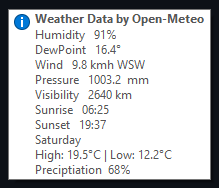

# Neon-Synthwave-Weather

<!--
*** Thanks for checking out the Best-README-Template (https://github.com/othneildrew/Best-README-Template). If you have a suggestion
*** that would make this better, please fork the repo and create a pull request
*** or simply open an issue with the tag "enhancement".
*** Don't forget to give the project a star!
*** Thanks again! Now go create something AMAZING! :D
-->

 

  
  

Synthwave style weather widget inspired by Eclectic Tech's 
  <a href="https://www.deviantart.com/eclectic-tech/art/DINAJ-Do-I-Need-A-Jacket-3-780733053">Do I need a jacket</a>

Includes a tooltip with additional information and tomorrow's forecast.

   
   
  <a href="https://github.com/grjsmith/Neon-Synthwave-Weather"><strong>Explore the docs »</strong></a>
   
  <a href="https://github.com/grjsmith/Neon-Synthwave-Weather/issues">Report Bug</a>
  ·
  <a href="https://github.com/grjsmith/Neon-Synthwave-Weather/issues">Request Feature</a>
  

<!-- TABLE OF CONTENTS -->

  
Table of Contents

  <ol>
    <li><a href="#about-the-project">About The Project</a>
      <ul>
        <li><a href="#built-with">Built With</a></li>
      </ul>
    </li>
    <li><a href="#getting-started">Getting Started</a>
      <ul>
        <li><a href="#prerequisites">Prerequisites</a></li>
        <li><a href="#installation">Installation</a></li>
      </ul>
    </li>
    <li><a href="#usage">Usage</a></li>
    <li><a href="#roadmap">Roadmap</a></li>
    <li><a href="#contributing">Contributing</a></li>
    <li><a href="#license">License</a></li>
    <li><a href="#contact">Contact</a></li>
    <li><a href="#acknowledgments">Acknowledgments</a></li>
  </ol>

## About The Project
I love the whole Synthwave aesthetic! I like the music, artists like [Dreamkid](https://open.spotify.com/artist/0603X4AUnZec4wiHJNsynF), [Daniel Delux](https://open.spotify.com/artist/0OTY72l7CC7ynKzp6N2o5b) and [Code Elektro](https://open.spotify.com/artist/3FIZFOkx25ESPENGx6st5w). I love [Robb Owen's SynthWave '84 VSCode](https://marketplace.visualstudio.com/items?itemName=RobbOwen.synthwave-vscode) theme. I made a [Synthwave](https://github.com/grjsmith/Neon-Synthwave) [Obsidian](https://obsidian.md/) theme and [Synthwave System Gauges for Rainmeter](https://github.com/grjsmith/Neon-Synthwave-Gauges) and a [Synthwave Clock for Rainmeter](https://github.com/grjsmith/Neon-Synthwave-Clock/). This is a Weather widget in a complimentary style.

(<a href="#top">back to top</a>)

### Built With

* [Rainmeter](https://www.rainmeter.net/)

(<a href="#top">back to top</a>)

## Getting Started
### Prerequisites

* Download Rainmeter from [https://www.rainmeter.net/](https://www.rainmeter.net/)
* Download the skins from [my site](https://entropybit.s3.eu-west-1.amazonaws.com/Neon+Synthwave+Weather_0.4.rmskin)

### Installation
* Install Rainmeter, [following the excellent documentation if you need it](https://docs.rainmeter.net/manual/installing-rainmeter/)
* Navigate to the place you saved ``Neon Synthwave Weather_0.4.rmskin`` and double click on it. That will open the Rainmeter skins window and all you to open the skins you want to use.

## Roadmap

* My wife says the font is hard to read. I included the original font I used, Nougat, which is easy to read. I might experiment with more fonts.
* I'm also tempted to create whole color palettes so rather than controlling the color of each layer individually it will be possible to select a palette and have all the colours change at once.

See the [open issues](https://github.com/grjsmith/Neon-Synthwave-Weather/issues) for a full list of proposed features (and known issues).

(<a href="#top">back to top</a>)

## Contributing
Contributions are what make the open source community such an amazing place to learn, inspire, and create. Any contributions you make are **greatly appreciated**.

If you have a suggestion that would make this better, please fork the repo and create a pull request. You can also simply open an issue with the tag "enhancement".
Don't forget to give the project a star! Thanks again!

1. Fork the Project
2. Create your Feature Branch (`git checkout -b feature/AmazingFeature`)
3. Commit your Changes (`git commit -m 'Add some AmazingFeature'`)
4. Push to the Branch (`git push origin feature/AmazingFeature`)
5. Open a Pull Request

(<a href="#top">back to top</a>)

## License
This skin was created by modifying Eclectic Tech's [Open Meteo Weather] skin. Which Ecletic Tech distributes under the CC-BY-NC-SA-4.0 license. As such this skin is distributed under that same license:
 
Creative Commons Attribution Non Commercial Share Alike 4.0 International
Short identifier
CC-BY-NC-SA-4.0

Other web pages for this license
https://creativecommons.org/licenses/by-nc-sa/4.0/legalcode
 

(<a href="#top">back to top</a>)

## Contact

* Grant Smith - [@grjsmith](https://twitter.com/grjsmith) - grant@nextgendevops.com
* Project Link: [https://github.com/grjsmith/Neon-Synthwave-Weather](https://github.com/grjsmith/Neon-Synthwave-Weather)

(<a href="#top">back to top</a>)

<!-- ACKNOWLEDGMENTS -->
## Acknowledgments
* Thanks to the Rainmeter team for the awesome tutorials

(<a href="#top">back to top</a>)
